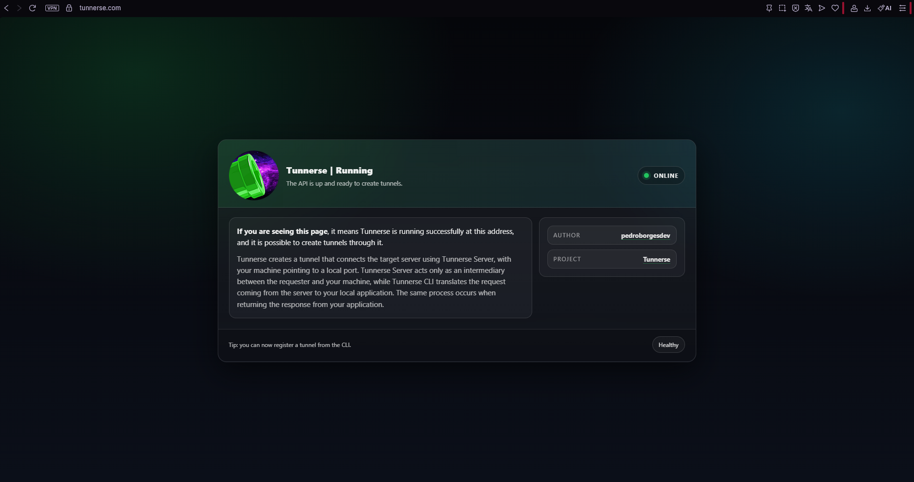

<p align="center">
  
</p>

<p align="center">
  <strong>Reverse HTTP tunnels for local development, demos, webhooks, and testing.</strong>
</p>

> Public service health can be checked at: https://tunnerse.com

## What Is Tunnerse?

Tunnerse exposes an HTTP service running on your machine to the public internet through a reverse tunnel. It is useful when a local app needs a temporary public URL without deploying it first.

Use Tunnerse to:

- Share local web apps with teammates or clients.
- Receive webhooks on `localhost`.
- Demo prototypes from your machine.
- Test integrations that require a public callback URL.


## Architecture

The project is intentionally small and split into three binaries:

- `cmd/cli`: terminal command used by the developer. It validates arguments, asks the local daemon to open a tunnel, prints the public URL, tails daemon logs, and stops the tunnel on `Ctrl+C`.
- `cmd/daemon`: local HTTP service running on the developer machine. It registers tunnels with the public server, polls for public requests, forwards them to `localhost:<port>`, sends responses back, and writes per-tunnel logs.
- `cmd/server`: public tunnel coordinator. It registers tunnel names, receives public HTTP traffic, queues requests in memory, waits for daemon responses, serves embedded status pages, and exposes configured domains over HTTPS.

There is no database and no repository layer. Tunnel state is kept in memory while the process is running. The daemon only persists log files so the CLI can stream what happened during a tunnel session.

## Request Flow

1. A local app is running, for example on `http://localhost:3000`.
2. The local daemon is running on `http://localhost:9988`.
3. The user runs `tunnerse http my-app 3000`.
4. The CLI posts the tunnel request to the local daemon.
5. The daemon registers `my-app` with the public server at `https://tunnerse.com/register`.
6. The public server creates an in-memory tunnel name, such as `my-app-a1b2c3d4`.
7. Public requests enter the server through either path routing or subdomain routing.
8. The server assigns each request a `Tunnerse-Request-Token` and places it in the tunnel queue.
9. The daemon long-polls the server through `/tunnel`, receives the queued request as JSON, decodes the body from base64, and forwards it to the local app.
10. The daemon encodes the local response body as base64 and posts it to `/response` with the same token.
11. The server matches the token to the pending public request and writes the response to the original client.
12. When the CLI receives `Ctrl+C`, it asks the daemon to stop the local job and the daemon asks the server to close the tunnel.

## Screenshots

CLI help:


Active tunnel in the terminal:


Server running page:



## Quick Start From Source

Requirements:

- Go 1.24 or newer.
- A local HTTP app to expose.
- A running public Tunnerse server, or the default `https://tunnerse.com`.

Build the binaries:

```bash
go build -o tunnerse ./cmd/cli
go build -o tunnerse-daemon ./cmd/daemon
go build -o tunnerse-server ./cmd/server
```

On Windows:

```powershell
go build -o tunnerse.exe ./cmd/cli
go build -o tunnerse-daemon.exe ./cmd/daemon
go build -o tunnerse-server.exe ./cmd/server
```

Start the local daemon:

```bash
./tunnerse-daemon
```

Create a tunnel:

```bash
./tunnerse http my-app 3000
```

Keep the command running while the tunnel should stay open. Press `Ctrl+C` to stop it.

## Project Version

The project version is defined in one place:

```text
internal/version/VERSION
```

The CLI embeds this value and the release scripts use it to name packages. `TUNNERSE_VERSION` can still be used as a temporary build override.

## Release Builds

Windows installer:

```bat
scripts\win\build.bat
```

Outputs:

```text
dist/tunnerse-installer_amd64_<version>.exe
dist/tunnerse-installer_x86_<version>.exe
```

Debian packages:

```bash
./scripts/unix/build.sh
```

Outputs:

```text
dist/tunnerse-installer_amd64_<version>.deb
dist/tunnerse-installer_x86_<version>.deb
dist/tunnerse-server-installer_amd64_<version>.deb
dist/tunnerse-server-installer_x86_<version>.deb
```

## Running A Public Server

The public server needs a `tunnerse.config` file for domain/TLS exposure. A `.env` file is optional; missing values fall back to defaults.

Example `.env`:

```env
HTTPPort=8080
SUBDOMAIN=false
WARNS_ON_HTML=true
TUNNEL_LIFE_TIME=86400
TUNNEL_INACTIVITY_LIFE_TIME=86400
TUNNEL_REQUEST_TIMEOUT=30
TUNNEL_QUEUE_SIZE=256
TUNNEL_MAX_PENDING_REQUESTS=256
```

Example `tunnerse.config`:

```ini
[domains]
*.your-server-domain.com=8080
your-server-domain.com=8080

[tls]
cert_file=certs/certificates/your-server-domain.com.crt
key_file=certs/certificates/your-server-domain.com.key
```

Then run:

```bash
go run ./cmd/server
```

The server starts the Gin API on `HTTPPort`, an HTTP redirect listener on `:80`, and an HTTPS reverse proxy listener on `:443`.

## Routing Modes

Path routing, the default:

```text
https://tunnerse.com/my-app-a1b2c3d4/path
```

Subdomain routing:

```text
https://my-app-a1b2c3d4.tunnerse.com/path
```

Set `SUBDOMAIN=false` for path routing or `SUBDOMAIN=true` for subdomain routing.

## Protocol Notes

The server-daemon protocol uses JSON. Request and response bodies are base64 encoded inside JSON so binary payloads survive the round trip.

Important limits and tradeoffs:

- Maximum request body: 32 MiB.
- Maximum local response body: 32 MiB.
- The server caps response JSON at roughly twice the body limit to account for base64 expansion.
- Hop-by-hop headers are stripped before forwarding.
- The daemon forces `Accept-Encoding: identity` when calling the local app.
- HTML rewriting is only attempted on uncompressed responses.
- The current design is for HTTP request/response traffic, not WebSockets, SSE, raw TCP, or streaming large files.

Base64 is simple and reliable for the current JSON polling protocol, but it is not the most efficient option for very large or streaming payloads.

## Repository Layout

```text
cmd/cli/        Terminal command for opening foreground tunnels
cmd/daemon/     Local daemon that forwards public traffic to localhost
cmd/server/     Public tunnel server and HTTPS expose layer
internal/cli/   CLI implementation packages
internal/daemon/Daemon API, tunnel loop, logs, and forwarding code
internal/server/Public API, tunnel queues, expose proxy, and embedded pages
assets/         Installer images, application icons, and documentation screenshots
scripts/        Build, installer, and deployment helpers
```

## Documentation

- [CLI command](cmd/cli/README.md)
- [Local daemon](cmd/daemon/README.md)
- [Public server](cmd/server/README.md)

## Project Status

Tunnerse is focused on developer workflows: fast local exposure, simple commands, visible logs, and a minimal stateless server. It is best suited for development, demos, webhook testing, and temporary integrations.

## License

See [LICENSE.md](LICENSE.md).
