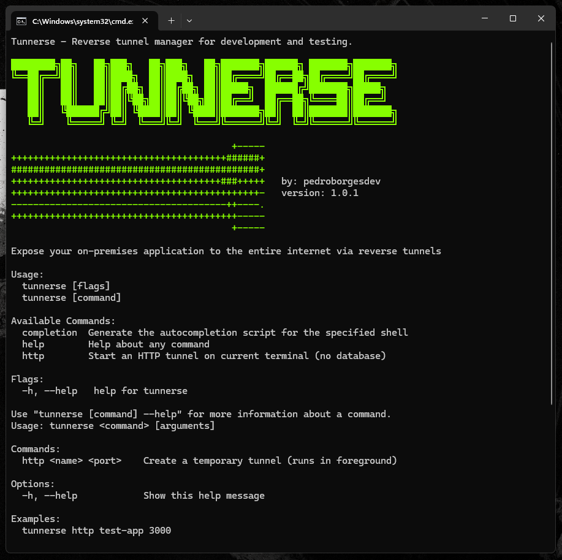
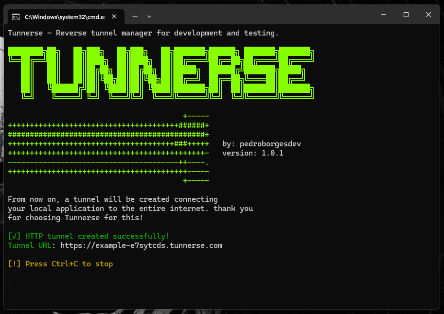

# Tunnerse CLI

`cmd/cli` builds the `tunnerse` terminal command. It is the user-facing entrypoint for opening an HTTP tunnel from a local port to the public Tunnerse server.

The CLI does not forward traffic by itself. It talks to the local daemon at `http://localhost:9988`; the daemon handles registration, polling, forwarding, logging, and shutdown.



## Responsibilities

- Validate tunnel names and local ports.
- Send tunnel creation requests to the local daemon.
- Print the generated public tunnel URL.
- Stream visible tunnel logs from the daemon.
- Stop the tunnel when the user presses `Ctrl+C`.

## Command

```bash
tunnerse http <tunnel_name> <local_port>
```

Example:

```bash
tunnerse http my-app 3000
```



The CLI currently uses this public server URL:

```text
https://tunnerse.com
```

The local daemon endpoint is fixed at:

```text
http://localhost:9988
```

## Validation

Tunnel names must match:

```text
^[a-z0-9-]{1,20}$
```

Valid examples:

```text
my-app
api
webhook-1
```

Invalid examples:

```text
MyApp
my_app
name-with-more-than-20-characters
```

Ports must be numeric and between `0` and `65535`.

## Runtime Flow

1. The user runs `tunnerse http my-app 3000`.
2. The CLI validates `my-app` and `3000`.
3. The CLI sends `POST http://localhost:9988/http`.
4. The daemon registers the tunnel with the public server.
5. The daemon returns the final generated tunnel name and routing mode.
6. The CLI builds and prints the public URL.
7. The CLI polls `GET /http/logs/:tunnel_id?offset=...` every 100 ms to stream new log output.
8. On `Ctrl+C`, the CLI sends `POST /http/stop` to the daemon.

## Local Daemon API Used By The CLI

Create a tunnel:

```http
POST /http
Content-Type: application/json
```

```json
{
  "name": "my-app",
  "port": "3000",
  "server_url": "https://tunnerse.com"
}
```

Read logs:

```http
GET /http/logs/my-app-a1b2c3d4?offset=0
```

Stop a tunnel:

```http
POST /http/stop
Content-Type: application/json
```

```json
{
  "tunnel_id": "my-app-a1b2c3d4"
}
```

## Build

```bash
go build -o tunnerse ./cmd/cli
```

On Windows:

```powershell
go build -o tunnerse.exe ./cmd/cli
```

The displayed CLI version comes from `internal/version/VERSION`. Release builds inject the same value through the project build scripts.

## Run From Source

Start the daemon in another terminal:

```bash
go run ./cmd/daemon
```

Run the CLI:

```bash
go run ./cmd/cli -- http my-app 3000
```

Or run the built binary:

```bash
./tunnerse http my-app 3000
```

## Troubleshooting

`Tunnerse local server is not online` means the CLI could not connect to `http://localhost:9988`. Start the daemon first.

`Invalid arguments` means the tunnel name or port failed local validation.

`Server returned error` means the daemon answered, but the public server registration failed or returned a non-OK response.

If the command is interrupted, the CLI asks the daemon to close the tunnel. If the daemon is already offline, the public server will eventually remove inactive tunnels according to its configured lifetime/inactivity timers.

## Related Docs

- [Local daemon](../daemon/README.md)
- [Public server](../server/README.md)
- [Project overview](../../README.md)
